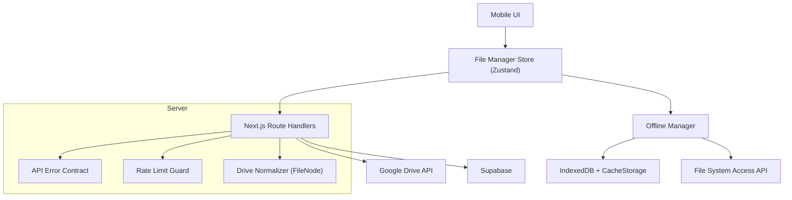
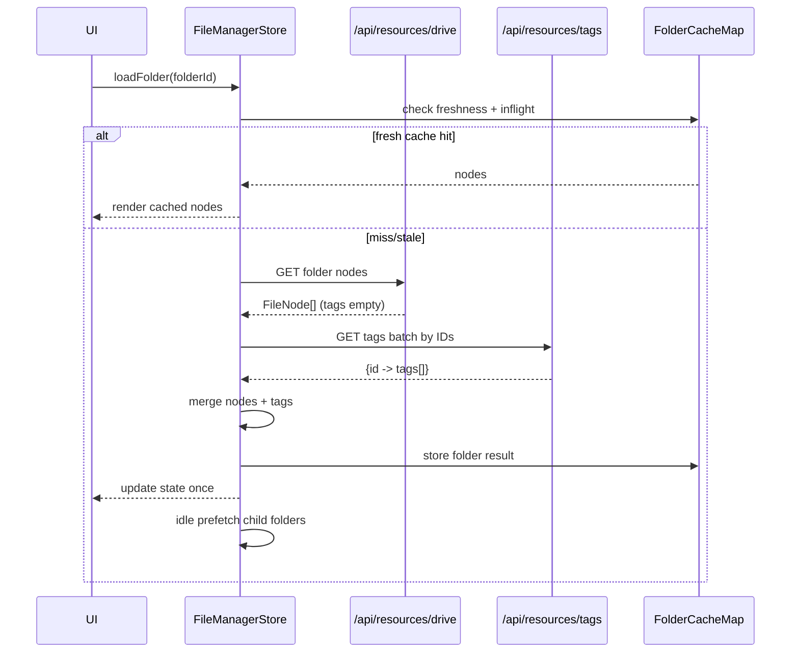
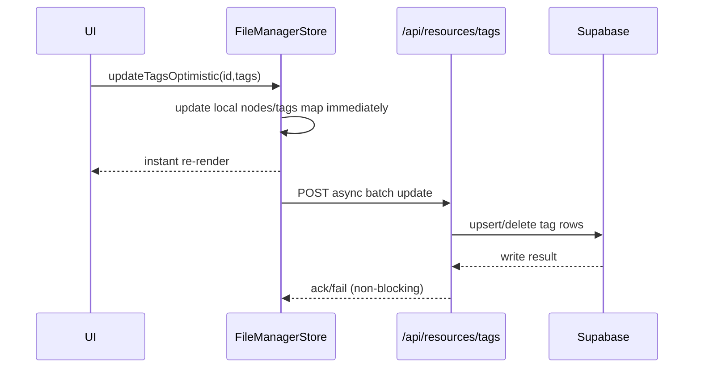
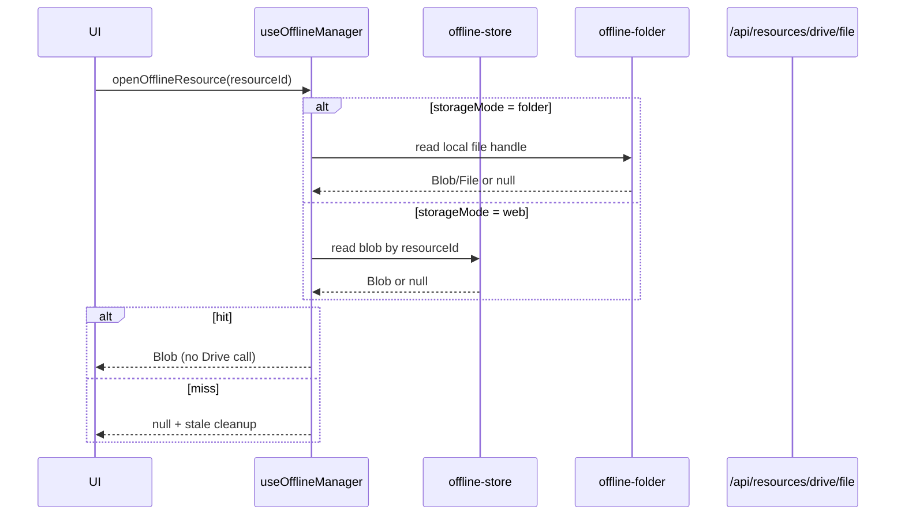

# Backend Architecture Review and Mobile-First Rewire

## 1. Current Backend Structure

### Route Map

- `GET /api/resources/courses`
  - Reads `courseRecords` from Supabase.
  - Parses `syllabusAssets` to extract Drive folder roots.
- `GET /api/resources/filters`
  - Reads distinct `department_id` and `semesterID` from Supabase.
- `GET /api/resources/drive`
  - Proxies Google Drive folder listing by `folderId`.
  - Returns normalized `FileNode[]` contract.
- `GET /api/resources/drive/file`
  - Proxies Drive file media/export downloads.
- `GET /api/resources/search`
  - BFS traversal across course root folders, returns matched nodes.
- `GET /api/resources/tags`
  - Batch reads tags by resource IDs.
- `POST /api/resources/tags`
  - Batch upserts/deletes tags (token-gated when `TAGS_WRITE_TOKEN` is configured).

### Core Libraries

- Supabase server client:
  - `src/lib/supabase/server.ts`
- Drive proxy and normalization:
  - `src/lib/resources/drive-server.ts`
- Tag storage integration:
  - `src/lib/resources/tags-server.ts`
- API wrappers and error contracts:
  - `src/lib/api/errors.ts`
  - `src/lib/api/rate-limit.ts`
  - `src/lib/api/fetch-json.ts`
- Offline persistence:
  - `src/lib/resources/offline-store.ts`
  - `src/lib/resources/offline-folder.ts`
  - `src/hooks/useOfflineManager.ts`

## 2. Layer Diagram



## 3. Dependency Mapping

| Layer        | Module                  | Depends On                               | Notes                                     |
| ------------ | ----------------------- | ---------------------------------------- | ----------------------------------------- |
| API          | `drive/route.ts`        | `drive-server.ts`, rate-limit            | No UI formatting logic                    |
| API          | `search/route.ts`       | Supabase, `drive-server.ts`, resource-id | Traversal logic server-side               |
| API          | `tags/route.ts`         | `tags-server.ts`                         | Batch read/write only                     |
| Data         | `drive-server.ts`       | Google Drive API                         | Shared proxy logic, de-duplicated         |
| Data         | `tags-server.ts`        | Supabase                                 | Optional tags table via env               |
| Client data  | `file-manager/store.ts` | `/drive`, `/tags` APIs                   | Centralized load/merge/cache              |
| Client state | `useFileManager.ts`     | Zustand selectors                        | Stable selector hooks                     |
| Offline      | `useOfflineManager.ts`  | `offline-store`, `offline-folder`        | No Drive re-fetch for opened cached files |

## 4. Data Contracts

### FileNode (UI-facing)

```ts
type FileNode = {
  id: string;
  name: string;
  type: "file" | "folder";
  size?: number;
  modifiedTime: string;
  mimeType: string;
  tags: string[];
};
```

### Contract Rules

- UI does not consume raw Google Drive payloads.
- Drive query syntax (`q`, paging, fields) is isolated to server utilities.
- Tag enrichment happens in loader/service layer, not in component tree.

## 5. Sequence Diagrams

### Folder Load (`fileManager.loadFolder`)



### Optimistic Tag Update



### Offline Open Path



## 6. Coupling Issues Found

1. Raw Drive contract leakage (fixed):

- Previous drive route returned Google fields directly.
- UI/data layers needed Drive-specific assumptions (`size` as string, folder MIME checks).

2. Duplicated Drive fetch logic (fixed):

- `drive/route.ts` and `search/route.ts` each implemented paging + query logic.
- Shared utility now isolates transport/query behavior.

3. UI-owned merge pipeline (fixed by new store):

- Previously UI hooks/components typically orchestrated load + tag merge + render.
- Centralized loader now owns fetch/merge/cache lifecycle.

4. Tag backend contract gap (fixed):

- Tag handling was local-state only and had no server batch endpoint.
- Added batch read/write API and server integration helper.

5. Missing client-side folder orchestration primitive (fixed):

- Added `fileManager.loadFolder(id)` as canonical entrypoint.

## 7. Performance and Scalability Enhancements

- Folder-level cache map with TTL.
- In-flight request de-duplication per folder.
- AbortController cancellation per folder load.
- Single state commit after drive+tag merge (avoids UI thrashing).
- Idle prefetch of top child folders for faster navigation.
- Debounced search state in central store.
- Optimistic local tag update with async server persistence.
- Batch tag reads and writes to avoid per-item network calls.

## 8. Security Review Findings

1. Drive key exposure:

- Drive API key remains server-side in route handlers (good).
- All Drive calls remain proxied through backend (good).

2. Tag mutation auth:

- Added token gate (`TAGS_WRITE_TOKEN`) for mutation endpoint.
- Recommendation: replace shared token with user/session-based auth when identity is available.

3. Resource IDs:

- File IDs remain exposed by contract to support download/open operations.
- Recommendation: if stricter obfuscation required, introduce opaque resource handles mapped server-side.

4. Rate limiting:

- Drive and search endpoints rate-limited at middleware + handler layers.
- Recommendation: use distributed store (Redis/KV) for multi-instance enforcement.

## 9. Clean UI-to-Backend Integration Model

- UI calls only:
  - `fileManager.loadFolder(folderId)`
  - `fileManager.updateTagsOptimistic(id, tags)`
  - `fileManager.setSearchQuery(query)`
- UI never calls Drive APIs directly.
- UI never merges tag data manually.
- Backend response contract for folder browsing is always `FileNode[]`.

## 10. Migration Plan (No Backend Breakage)

1. Phase 1: Contract dual-support

- Keep current routes and course/filter payloads stable.
- Migrate folder views to `FileNode` contract from `/api/resources/drive`.

2. Phase 2: Mobile UI adoption

- Replace per-screen data-fetch chains with `fileManager.loadFolder`.
- Keep legacy hooks available while screens migrate incrementally.

3. Phase 3: Tag authority switch

- Move from local-only tags to `/api/resources/tags` for canonical reads/writes.
- Keep optimistic local behavior for responsiveness.

4. Phase 4: Legacy cleanup

- Remove direct raw Drive item assumptions in remaining components/hooks.
- Remove duplicated folder fetch/tag merge logic from UI codepaths.

Result: UI can be redesigned repeatedly while backend contracts remain stable.
